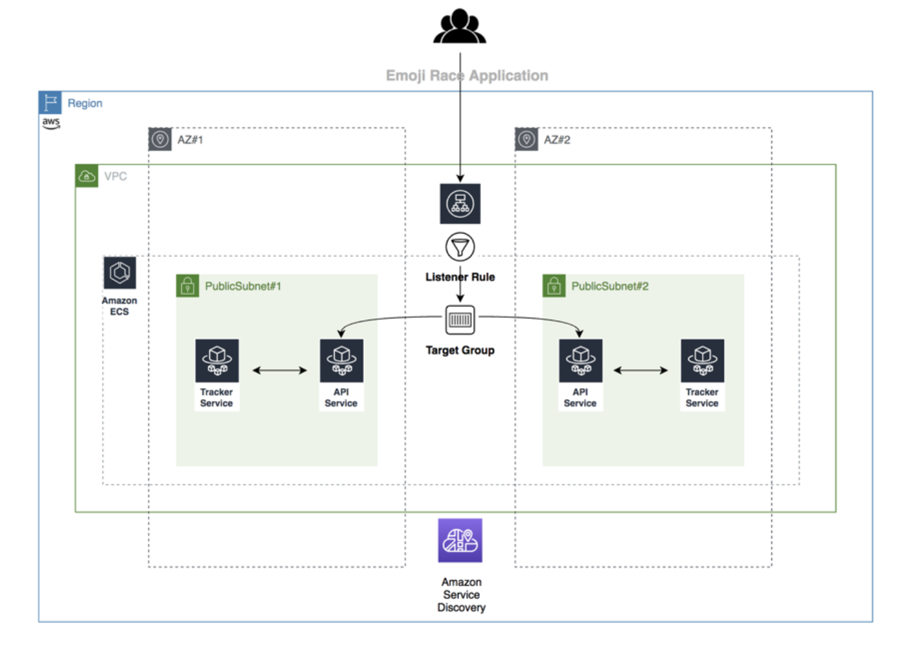

# Developing an application based on multiple microservices using AWS Copilot and AWS Fargate
 

## Introduction
On July 9, 2020, we introduced AWS Copilot, a new command line interface (CLI) to build, release, and operate production ready containerized applications on Amazon Elastic Container Service (Amazon ECS) and AWS Fargate. In this post, we walk you through how to communicate between microservices with service discovery using  AWS Copilot.
To illustrate, we will build a fully functional application named “emoji-race” to display the most popular emojis on Twitter. The application will be composed of a “tracker”Backend Service that subscribes to a stream of Twitter emojis and stores the counts in memory, and an “api” frontend service that will accept requests from the internet and query the “tracker” service to send the top results back to the users.

## Prerequisites
To implement the instructions in this post, you will need the following accounts:

* An AWS account – [how to create a new AWS account](https://aws.amazon.com/premiumsupport/knowledge-center/create-and-activate-aws-account/)
* A GitHub account – [sign up for a new GitHub account](https://help.github.com/en/github/getting-started-with-github/signing-up-for-a-new-github-account)

## Architecture
AWS Copilot provides a simple declarative set of commands, including examples and guided experiences built in to help customers deploy quickly. AWS Copilot automates each step in the deployment lifecycle including pushing to a registry, creating a task definition, and creating a cluster.

## Steps
Here are the steps we’ll follow to implement the above architecture:

1. Create and configure the AWS Cloud9 environment
    * Install AWS Copilot
    * Configure AWS CLI
2. Building the application
    * Clone the GitHub repository
    * Create the “emoji-race” application
    * Create the Backend Service
    * Create the Load Balanced Web Service

## Details
For additional details, please refer to the associated [blog post](https://aws.amazon.com/blogs/containers/developing-an-application-based-on-multiple-microservices-using-the-aws-copilot-and-aws-fargate/).
